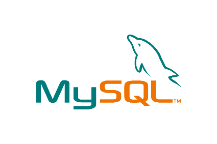

### Hi there 👋

<!--
**AdityaMisra/AdityaMisra** is a ✨ _special_ ✨ repository because its `README.md` (this file) appears on your GitHub profile.
-->

🔭 :octocat: I am [Aditya](http://adityamisra.com/), a pragmatic engineer & a polyglot developer from [🇮🇳 ](https://en.wikipedia.org/wiki/India)&nbsp; with 5+ years of professional working experience. 🚀

🌱 I’m currently mastering Micro-service based architecture & solving complex problems with simple design.

### 😄 Pronouns: 
     he/him

### Technologies I work with :information_desk_person:

#### Languages

    
  
  
  
 

  
#### Frameworks
  
 

   
  
  
  
 

  
#### Storage
  
 

  
  

  
 

  
  
   

#### Others

  
  
  

### 🌱 I’m currently learning:

### 📫 How to reach me:
  Connect with me on [LinkedIn](https://www.linkedin.com/in/aditya-misra-40246428/) :bowtie:  
  Follow me on [Twitter](https://twitter.com/realadityamisra) 🐦   
  Visit my [Website](https://adityamisra.com) 🚧 🌐   
  Send an [Email](mailto:amisra14@yahoo.co.uk)  ✏️ 📝   
